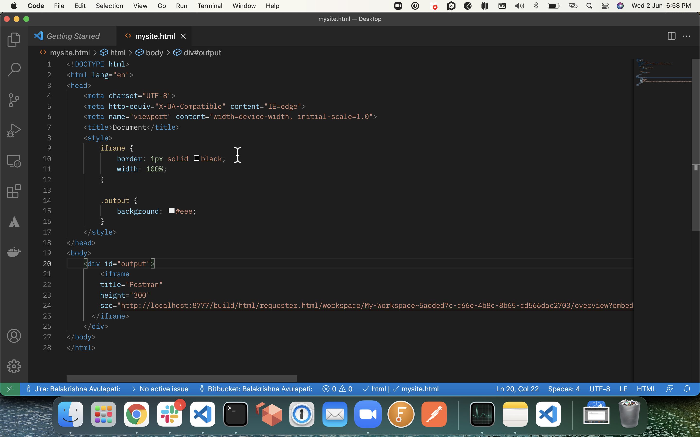

## Welcome to Embedding Postman widgets

You can use the  to retrieve, customize and preview the embeddable code snippet for your chosen postman widget.  

Whenever you click on the embed button available on postman widget, you will see a copyable, customizable code snippet. We can also use the available customizations like height and width of the embedded content.  
 

We can use the **copy** button to get the final embeddable code

Use the copied embed code snippet in the website similar to  

And the Website will have the selected postman widget rendered as follows  

[Preview embed](preview.html)
